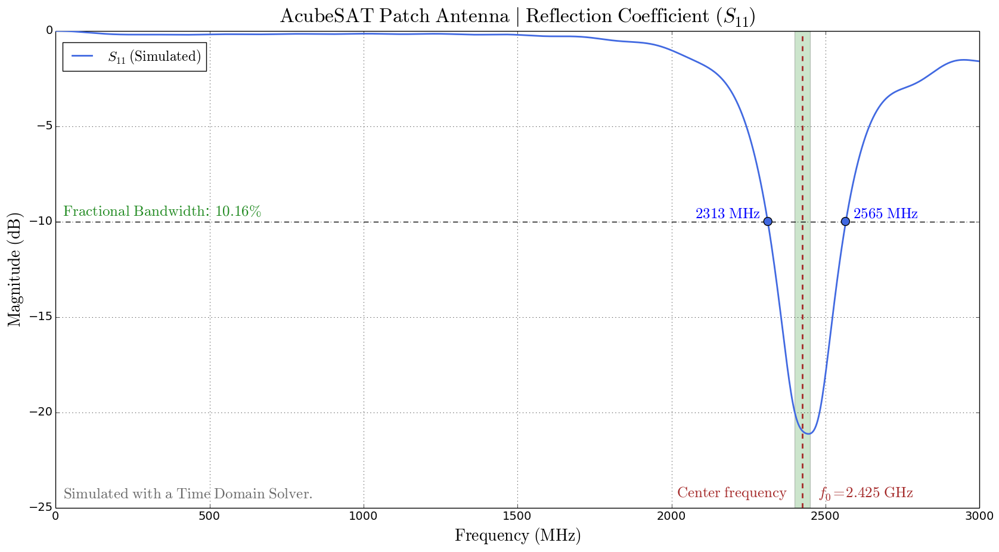
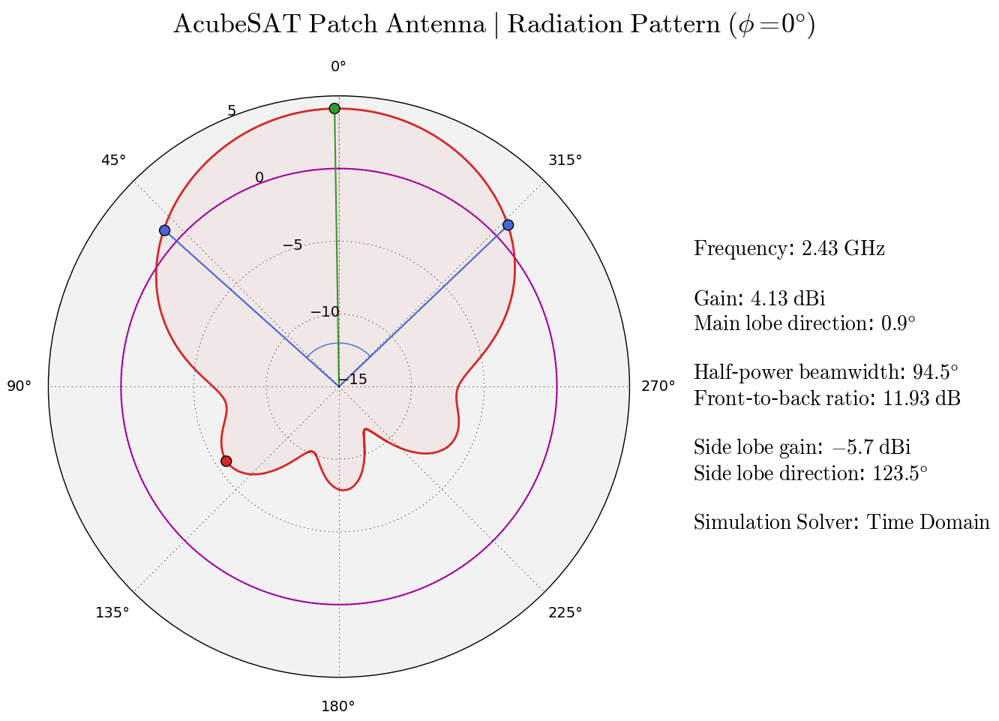

# S-Band Patch Antenna

Design files of S-band patch antenna to be used on board the AcubeSAT are included in the `CST Design Files` folder and test results for the designed antenna are included in the `Anechoic Chamber Tests` folder. A plotter has also been written to plot S11 data taken from CST as a .png with annotations. Can be used to compare measured data with simulations and visualize results in a convenient fashion:

A plotter has also been written to plot farfield (radiation pattern) data taken from CST as a .png with annotations. Can be used to compare measured data with simulations and visualize results in a convenient fashion:

